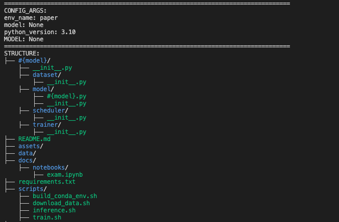
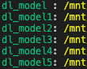
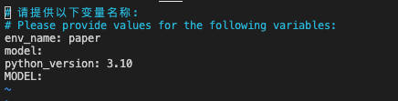
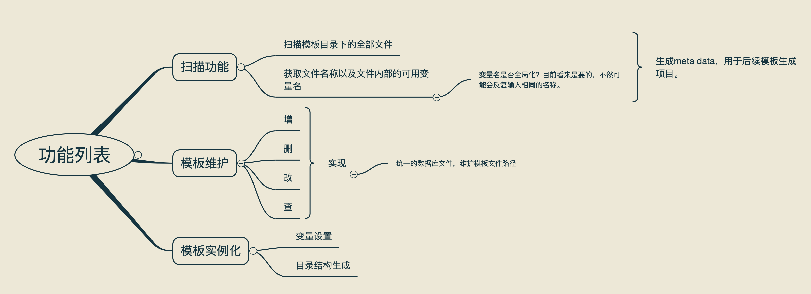

## 下载安装

下载repo
```shell
git clone https://github.com/taolizhicheng/project_template.git
```

创建conda环境并进入该环境
```shell
conda create [env_name] python=3.10
conda activate [env_name]
```

运行安装脚本
```shell
./scripts/install.sh
```

## 使用方法

### 创建项目模板

参照`examples/dl_model`目录。
```text
|-- root/
    |-- #{project_name}/      # 根据提供的project_name，生成对应的文件夹
        |-- __init__.py
        |-- #{arg1}.py        # 根据arg1的值，生成对应的文件
        |-- #{arg2:aaa}.py    # 根据arg2的值，生成对应的文件，'aaa'为默认值
    |-- unittests
        |-- __init__.py
        |-- test_#{arg1}.py     # 根据arg1的值，生成对应的文件
        |-- test_#{arg2}.py     # 根据arg2的值，生成对应的文件，'aaa'为默认值（从 #{arg2:aaa}.py 中获取默认值）
    |-- README.md
    |-- pyproject.toml
    |-- setup.py
```

组织文件内容，如`#{arg1}.py`文件，假设内容如下：
```python
import #{project_name}.#{arg2}

def main():
    #{arg2}.print_hello()  # 调用#{arg2}模块的print_hello函数

if __name__ == "__main__":
    main()
```

给定对应的变量名，假设：
```yaml
project_name: hello_world
arg1: file1
arg2: file2
```

则目录结构如下：
```text
|-- root/
    |-- hello_world/
        |-- __init__.py
        |-- file1.py
        |-- file2.py
    |-- unittests
        |-- __init__.py
        |-- test_file1.py
        |-- test_file2.py
    |-- README.md
    |-- pyproject.toml
    |-- setup.py
```

`file1.py`文件内容如下：
```python
import hello_world.file2

def main():
    file2.print_hello()  # 调用file2模块的print_hello函数

if __name__ == "__main__":
    main()
```


### 模板管理(CLI)

#### 新增模板

根据项目路径新增项目模板
```shell
project-template \ 
--add \ 
--name <template-name> \ 
--project-dir <project-dir> \ 
--template-dir <save-dir> # optional, path to save template
```

具体例子：
```shell
# 将examples/dl_model目录作为模板，命名为dl_model，并保存到/tmp/dl_model目录，默认保存路径为~/.project-template/templates目录
project-template --add --name dl_model --project-dir ./examples/dl_model --template-dir /tmp/dl_model
```


#### 更新模板

根据项目路径更新项目模板
```shell
project-template \
--update \ 
--name <template-name> \ 
--project-dir <project-dir> \ 
--template-dir <save-dir>  # optional, path to save template
```

具体例子：
```shell
# 将examples/dl_model目录作为模板，覆盖原来的dl_model模板，并保存到/tmp/dl_model目录，默认保存路径为~/.project-template/templates目录
# 如果dl_model模板不存在，会报错
project-template --update --name dl_model --project-dir ./examples/dl_model --template-dir /tmp/dl_model
```

#### 删除项目模板

```shell
project-template \ 
--delete \ 
--name <template-name>
```

具体例子：
```shell
project-template --delete --name dl_model
```

#### 查看项目模板
```shell
project-template \ 
--list \ 
--name <template-name>  # optional, list all templates if not specified
```

具体例子：
```shell
project-template --list --name dl_model
```

结果如下：



如果不指定`--name`，则列出所有模板：
```shell
project-template --list
```

结果如下：




#### 根据项目模板生成项目

```shell
project-template \ 
--instantiate \ 
--name <template-name> \ 
--project-dir <project-dir>
```

具体例子：
```shell
# 根据dl_model模板，生成项目到/tmp/test目录
project-template --instantiate --name dl_model --project-dir /tmp/test
```

过程中填入所需的参数保存即可（Linux系统默认vim编辑器）：



### 根据项目生成模板

从一个现有项目中抽取变量，并生成模板。

这样一来，可以进行项目的验证后，再转为模板，避免出现模板项目不可编译运行的问题。

运行命令：
```shell
project_template --generate --project-dir <project-dir> --template-dir <save-dir> --rule-file <rule-file>
```

其中，`project-dir`为现有项目目录，`template-dir`为模板目录路径，`rule-file`为规则文件路径。

规则文件为json格式，内容如下：
```json
{
    "ignore_files": [
        ".git/",
        ".DS_Store",
        ".idea/",
        ".vscode/"
    ],
    "rules": [
        {
            "value_name": "arg1"
        },
        {
            "value_name": "arg2",
            "default_value": "aaa"
        }
    ]
}
```

`ignore_files`为需要忽略的文件，`rules`存放需要抽取的变量，`value_name`为变量名，`default_value`为变量默认值。

具体例子，假设有如下项目结构（即`--project-dir`）：
```text
|-- root/
    |-- .gitignore
    |-- aa.py
    |-- main.py
    |-- utils.py
    |-- README.md
```

其中，`aa.py`文件内容如下：
```python
class A:
    def __init__(self):
        self.a = 1
```

`rule-file`内容如下：
```json
{
    "ignore_files": [
        ".gitignore"
    ],
    "rules": [
        {
            "value_name": "aa"
        },
        {
            "value_name": "A",
            "default_value": "Example"
        }
    ]
}
```

那么，运行命令
```shell
project_template --generate --project-dir <project-dir> --template-dir <save-dir> --rule-file <rule-file>
```

会生成模板如下：
```text
|-- root/
    |-- #{aa}.py
    |-- main.py
    |-- utils.py
    |-- README.md
```

其中，`#{aa}.py`文件内容如下：
```python
class #{A:Example}:
    def __init__(self):
        self.a = 1
```

然后，通过`project-template --add`方式加入到模板库即可。

## 开发逻辑



## TODO

- 支持前端填入